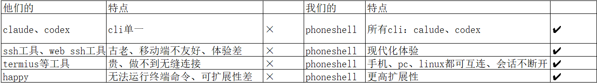
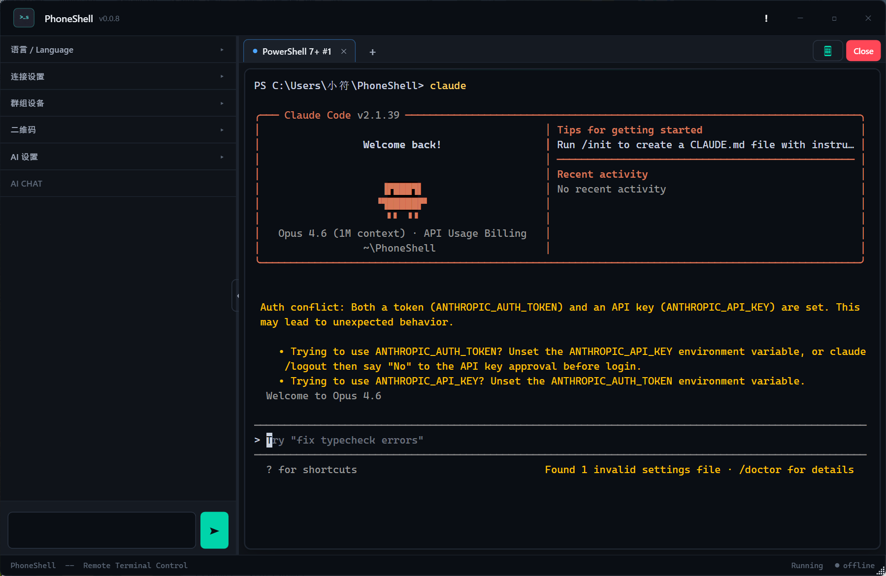
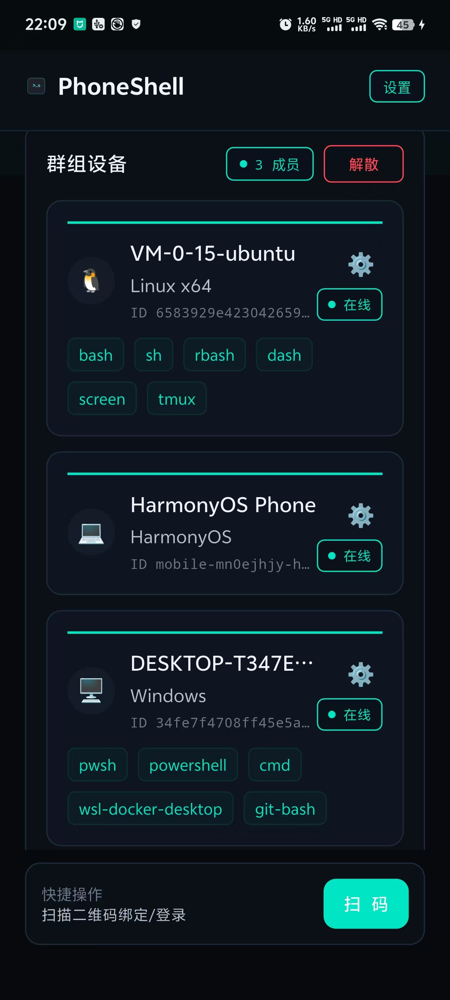
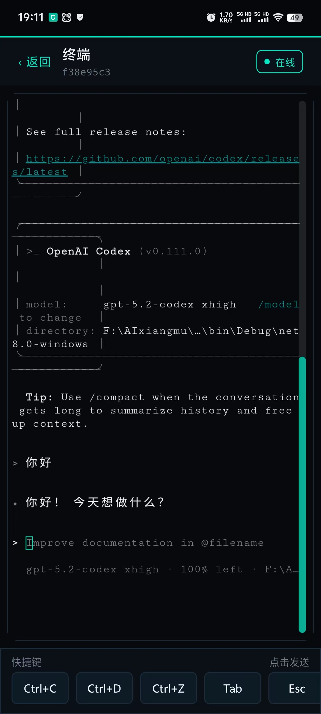
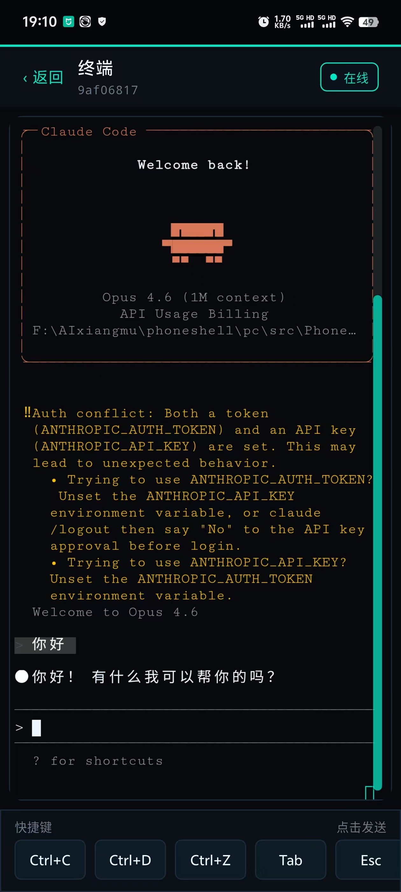

# PhoneShell

> Your terminal, on your phone. Remote-control Windows / Linux terminals from anywhere.

**English** | [中文](README_zh.MD)

---

## Why PhoneShell

- **Phone as Terminal** — Native shell experience on your phone. Code with AI anytime, anywhere.
- **Sessions Never Die** — Built around the group concept, terminal sessions seamlessly hand off between phone, PC, and Linux within a group. Processes keep running.
- **Works with Every CLI** — Compatible with all command-line tools: `claude`, `codex`, `gemini`, `kiro`, `droid`, `vim`, `top`...
- **Multi-Platform** — Windows desktop + Linux server + Android / HarmonyOS mobile (iOS planned).
- **Beginner Friendly** — No complex configuration needed. Just open the app, scan the QR code, and you're connected.

## Highlights

- **Claude / Codex Ready** — Works smoothly with Claude and Codex CLI.
- **Not Locked to One CLI** — Use any CLI, not tied to a single tool.

---

## Comparison

<p align="center">
  
</p>

---

## Screenshots

<p align="center">
  
  
</p>
<p align="center">
  
  
</p>

---

## Architecture

```
┌─────────────┐  QR / WebSocket  ┌──────────────────┐  WebSocket  ┌─────────────┐
│  Android    │◄────────────────►│  Windows Desktop  │◄──────────►│  Linux      │
│  HarmonyOS  │                  │  (Relay+Terminal) │            │  (Relay+    │
│  (Mobile)   │                  │                   │            │   Terminal) │
└─────────────┘                  └──────────────────┘            └─────────────┘
       │                                │                              │
       │         QR / WebSocket         │         QR / WebSocket       │
       │           ┌────────────────────┘                              │
       │           ▼                                                   │
       │    ┌─────────────┐                                           │
       └───►│  Web Panel   │◄──────────────────────────────────────────┘
            └─────────────┘
```

**Connection Modes:**
- **Group** — Multiple devices form a group with invite codes, member management, and kick.

---

## Core Features

| Feature | Description |
|---------|-------------|
| Multi-session | Create, rename, and switch between multiple terminal sessions |
| History Replay | Paginated terminal output history; context survives reconnects |
| QR Connect | Scan to connect (`phoneshell://connect`), bind group (`phoneshell://bind`), or log into web panel (`phoneshell://login`) |
| Groups & Invites | Relay server, invite codes, secret rotation, server migration |
| Control Ownership | Request/grant terminal control, force disconnect |
| Web Panel | Device list, session management, QR login, powered by Vue.js |
| AI Assistant | OpenAI-compatible API (configurable endpoint & model), auto-detects shell type, TUI app control |
| TLS/SSL | Automatic wss encryption when certificates are configured |
| i18n | Built-in Chinese / English language toggle on mobile |

---

## Quick Start

### Windows

1. Run `PhoneShell.App.exe` as Administrator.
2. Click **Start**.

### Android / HarmonyOS

1. Install and open the app.
2. Scan the QR code displayed on the Windows or Linux client to connect.

### Linux

```bash
# Install dependencies (Ubuntu / Debian)
sudo apt-get update
sudo apt-get install -y git nodejs npm python3 build-essential

# Clone and install
git clone https://github.com/ggbook123/phoneshell.git
cd phoneshell
sudo bash linux2/deploy/phoneshell install
```

---

## Linux Deployment

### Prerequisites

- Linux with systemd
- Node.js >= 18
- Build tools for `node-pty`: `python3`, `make`, `g++`

### Common Commands

```bash
phoneshell                       # Connect to local terminal
phoneshell list                  # List active sessions
phoneshell attach                # Attach to an existing session
phoneshell local --shell bash    # Specify shell type
phoneshell set                   # Update configuration
phoneshell start                 # Start the service
```

### Configuration

Default config file: `/etc/phoneshell/config.json`

```jsonc
{
  "port": 19090,
  "panelPort": 0,
  "publicHost": "",
  "tls": {
    "enabled": true,
    "certPath": "/path/to/cert.pem",
    "keyPath": "/path/to/key.pem"
  },
  "modules": {
    "terminal": true,
    "relayServer": false,
    "relayClient": true,
    "webPanel": true,
    "aiChat": false
  }
}
```

Environment variable overrides are also supported: `PHONESHELL_PORT`, `PHONESHELL_PUBLIC_HOST`, `PHONESHELL_TLS_CERT`, etc.

After changes: `sudo systemctl restart phoneshell`

### Web Panel

- When enabled, visit: `http://<host>:<panelPort>/panel/`
- If `modules.webPanel=false`, panel endpoints return 404, but `/ws/` still works.
- SSL certificates are automatically used for wss connections when configured.

---

## Project Structure

```
phoneshell/
├── pc/              # Windows desktop client (C# / WPF / .NET 8)
│   └── src/
│       ├── PhoneShell.App/      # WPF app + WebView2 terminal
│       └── PhoneShell.Core/     # Core: ConPTY, Relay, protocol, AI
├── harmony/         # HarmonyOS client (ArkTS)
├── phoneshell/      # Android client (Flutter)
└── linux2/          # Linux server (Node.js / TypeScript)
    ├── src/                     # Server source
    │   ├── relay/               # WebSocket Relay server/client
    │   ├── terminal/            # node-pty terminal management
    │   ├── auth/                # Tokens, invite codes, QR
    │   └── protocol/            # Message serialization
    ├── web/                     # Vue.js web management panel
    └── deploy/                  # Install scripts & systemd config
```

---

## Tech Stack

| Component | Technology |
|-----------|------------|
| Windows Desktop | C# / WPF / .NET 8 / WebView2 / ConPTY / xterm.js |
| Linux Server | Node.js / TypeScript / node-pty / WebSocket (ws) |
| Web Panel | Vue.js / xterm.js / Vite |
| Android | Flutter / WebView / mobile_scanner |
| HarmonyOS | ArkTS / WebView / Camera scan |
| Protocol | WebSocket + JSON messages (TLS/wss supported) |

---

## License

This project is licensed under the GNU AGPL-3.0. See [LICENSE](LICENSE).
